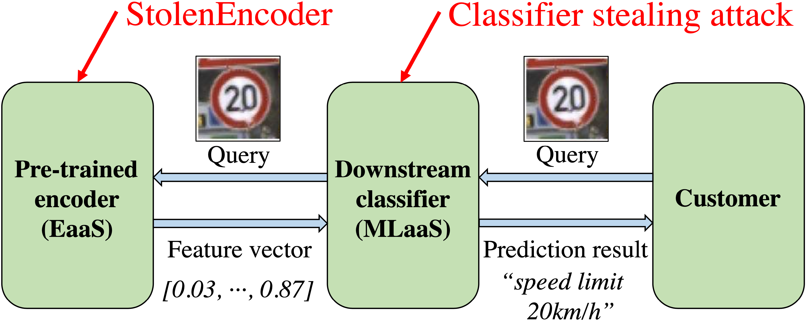

# [StolenEncoder: Stealing Pre-trained Encoders in Self-supervised Learning](https://arxiv.org/abs/2201.05889)


This repository contains the code of [StolenEncoder](https://arxiv.org/abs/2201.05889), a model stealing attack that extracts the functionality of deployed self-supervised learning encoders with only black-box access.

Pre-trained encoders are general-purpose feature extractors that can be used for many downstream tasks. Recent progress in self-supervised learning can pre-train highly effective encoders using a large volume of _unlabeled_ data, leading to the emerging _encoder as a service (EaaS)_. A pre-trained encoder may be deemed confidential  because its training often requires lots of data and computation resources as well as its public release may facilitate misuse of AI, e.g., for deepfakes generation. In this work, we propose  the first attack called _StolenEncoder_ to steal pre-trained image encoders. 

Here is a figure to illustrate the difference between our attack and traditional model stealing attacks to supervised learning models:


<div align="center">

</div>


## Citation

If you use this code, please cite the following [paper](https://arxiv.org/pdf/2108.00352.pdf):
```
@inproceedings{liu2022stolenencoder,
  title={StolenEncoder: Stealing Pre-trained Encoders in Self-supervised Learning},
  author={Liu, Yupei and Jia, Jinyuan and Liu, Hongbin and Gong, Neil Zhenqiang},
  booktitle={ACM Conference on Computer and Communications Security (CCS)},
  year={2022}
}
```


## Required python packages

Our code is tested under the following environment: Ubuntu 18.04.5 LTS, Python 3.8.5, torch 1.7.0, torchvision 0.8.1, numpy 1.18.5, pandas 1.1.5, pillow 7.2.0, and tqdm 4.47.0.

## Extracted image encoders

Please refer to the link ([google drive](https://drive.google.com/file/d/13Fjiz2f6lmj9oQ0Rrl5n1sWE8dZl6b0h/view?usp=sharing)) for extracted models from encoders pre-trained on CIFAR10, STL10, and Food101. 

## Feedback

If you have any questions, please feel free to open an issue and ask me there. If you need the data we used in our experiments (including the intermediate feature vectors) or the extracted CLIP or ImageNet models, feel free to send me requests as well. 
